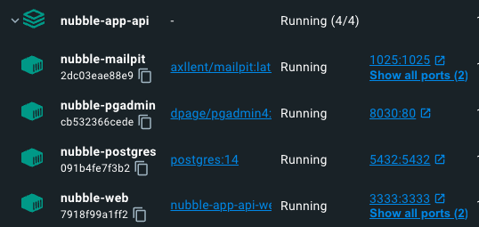

# Configuração de Ambiente
## Instalar o docker

https://www.docker.com/

## Instalar Beekeeper Studio (Community Edition)

https://github.com/beekeeper-studio/beekeeper-studio

## Instalar dependências
```shell script
# Instalar dependências de desenvolvimento
yarn
```

## Iniciar Backend
Todas as etapas para criar o backend estão reunidas em um único comando: 

```shell script
# Instalar dependências de desenvolvimento
make docker-install
```
O comando acima é um atalho para realizar as seguintes tarefas:
```shell script
# Command 1: Copy .env.example to .env
cp .env.example .env

# Command 2: Build Docker containers
make docker-build

# Command 3: Run database migrations in Docker
make migration-docker

# Command 4: Reset Database and run seeds
make reset-docker

# Command 5: Install project dependencies with Yarn
yarn

# Command 6: Generate Swagger documentation
make generate-docs
```

Abra o Docker Dashboard para verificar se todos os containers foram criados.


#### 2. Conectar Banco de dados
Chegou a hora de conectar o banco de dados. Abra o Beekeeper Studio e crie uma nova conexão.

- Selecione Postgres
- Mantenha Host (localhost) e Port padrão (5432)
- Credenciais
     Campo | Valor
    --- | ---
    User | nubble
    Password | nubble
    Default Database | nubble_db_development
- Dê um nove para a conexão. Ex "Nubble" e pressione "Save".


#### 3. Rodar Servidor

```shell script
yarn dev
```
**Pronto! A Nubble API está pronta para ser utilizada! 🥳**

Aplicações | URL
--- | ---
App - NodeJs | <http://localhost:3333>
Documentação - Swagger | <http://localhost:3333/docs>
Postgres - pgAdmin | <http://localhost:8030>
E-mail - Mailpit | <http://localhost:8040>

### Tecnologias Utilizada


- [Docker][l-docker]
- [NodeJs v18.17.0][l-nodejs]
- [Adonis v5][l-adonis]
- [Postgres v14][l-postgres]
- [pgAdmin][l-pgadmin]
- [Mailtip][l-mailpit]
- [Adonis Auto Swagger][l-swagger]


[l-docker]: https://www.docker.com
[l-nodejs]: https://nodejs.org
[l-adonis]: https://adonisjs.com
[l-postgres]: https://hub.docker.com/_/postgres
[l-pgadmin]: https://www.pgadmin.org
[l-mailpit]: https://github.com/axllent/mailpit
[l-swagger]: https://github.com/ad-on-is/adonis-autoswagger
